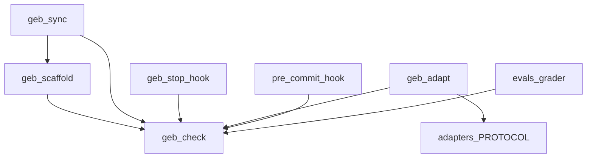

# fugue-docs — 项目索引(L1)

> 本文件是项目的语义相入口。架构变更(模块增删、依赖关系变化、技术栈调整)后必须更新本文件。

## 定位
GEB 分形文档协议的工具集仓库:以 Claude Code skill 为最佳体验、万模通用的协议实现,包含协议文本、检查器、脚手架、适配器与硬约束钩子。本仓库自身遵循本协议(吃自己的狗粮),CI 会对自身做同构检查。

## 技术栈
Python 3(≥3.6,零第三方依赖)+ POSIX shell + Markdown。Claude Code skill / 插件市场分发;`gh`/git 用于发布。

## 目录结构
```text
fugue-docs/
├── SKILL.md           # 协议本体(Claude Code skill 入口)
├── adapters/          # 协议可移植核心(中/英),万模通用的单一事实来源
├── assets/            # logo 等静态资源
├── evals/             # 评测包:用例、夹具、评分器、理解成本测验 → evals/FOLDER_INDEX.md
├── references/        # L1/L2/L3 多语言模板库
└── scripts/           # 全部可执行工具 → scripts/FOLDER_INDEX.md
```

## 模块依赖关系


## 根目录文件
| 文件 | 职责 |
|------|------|
| SKILL.md | 协议本体,Claude Code skill 定义 |
| README.md / README_EN.md / README_JA.md | 三语说明文档 |
| PROJECT_INDEX.md | 本文件(L1) |
| LICENSE | MIT,含思想来源致谢 |

## 全局约定
- 所有脚本仅用 Python 3 标准库,保持 3.6+ 兼容(用户环境可能很旧)。
- adapters/PROTOCOL.md 是协议核心的单一事实来源;改协议先改它,再同步 SKILL.md。
- 本仓库自身必须通过 `python3 scripts/geb_check.py . --strict`。
