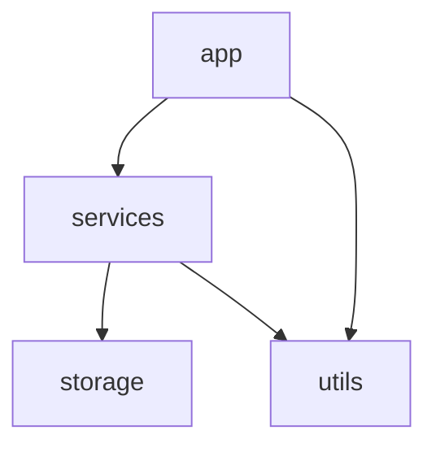

# team-roster — 项目索引(L1)

> 本文件是项目的语义相入口。架构变更(模块增删、依赖关系变化、技术栈调整)后必须更新本文件。

## 定位
一个命令行团队名册工具:管理用户(增删查),并生成文本报表。数据存在本地 JSON 文件中。

## 技术栈
Python 3 标准库,无第三方依赖。入口 `python3 app.py <command>`。

## 目录结构
```text
team-roster/
├── app.py          # 程序入口,命令分发
├── utils.py        # 通用工具(校验等)
├── services/       # 业务逻辑层 → services/FOLDER_INDEX.md
└── storage/        # 持久化层 → storage/FOLDER_INDEX.md
```

## 模块依赖关系


## 根目录文件
| 文件 | 职责 | 关键导出 |
|------|------|----------|
| app.py | 程序入口,解析命令行并分发到 services | main() |
| utils.py | 通用校验工具 | validate_email() |

## 全局约定
- 所有用户数据读写必须经过 storage 层,services 不直接碰文件。
- 报错统一 print 到 stderr 并返回非 0 退出码。
