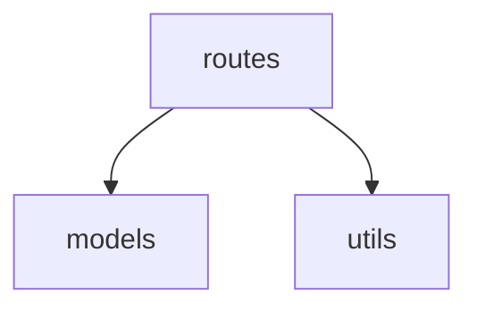

# GEB 模板库

L1 / L2 完整模板 + 各语言 L3 文件头模板。初始化项目或新建文件时按需取用。

## 目录

- [L1 模板:PROJECT_INDEX.md](#l1-模板)
- [L2 模板:FOLDER_INDEX.md](#l2-模板)
- [CLAUDE.md 协议声明段](#claudemd-协议声明段)
- [L3 文件头(按语言)](#l3-文件头按语言)

---

## L1 模板

```markdown
# <项目名> — 项目索引(L1)

> 本文件是项目的语义相入口。架构变更(模块增删、依赖关系变化、技术栈调整)后必须更新本文件。

## 定位
<一句话:这个项目是什么、给谁用、解决什么问题>

## 技术栈
<语言 / 框架 / 关键依赖 / 运行方式>

## 目录结构
```text
project/
├── src/            # <一句话职责> → src/FOLDER_INDEX.md
│   ├── routes/     # <一句话职责> → src/routes/FOLDER_INDEX.md
│   └── models/     # <一句话职责> → src/models/FOLDER_INDEX.md
└── utils/          # <一句话职责> → utils/FOLDER_INDEX.md
```

## 模块依赖关系


## 根目录文件
| 文件 | 职责 | 关键导出 |
|------|------|----------|
| app.py | 程序入口,命令分发 | main() |

## 全局约定
<错误处理方式、命名约定、其他全项目法则>
```

## L2 模板

```markdown
# <文件夹路径> — 模块索引(L2)

> 本文件夹内文件增删、重命名、接口变更时,必须更新本文件。上级索引:[../PROJECT_INDEX.md](../PROJECT_INDEX.md)

## 模块定位
<本模块在整体架构中扮演什么角色,被谁调用,调用谁>

## 文件清单
| 文件 | 职责 | 关键导出 |
|------|------|----------|
| auth.js | 登录注册路由 | router, POST /login, POST /register |
| users.js | 用户 CRUD 路由 | router, GET/POST/DELETE /users |
```

## CLAUDE.md 协议声明段

追加到项目已有的 `CLAUDE.md`(没有则建议创建):

```markdown
## GEB 分形文档协议

本项目遵循 GEB 协议:代码是机器相,文档是语义相,两相必须同构。
- 动手前:先读 [PROJECT_INDEX.md](PROJECT_INDEX.md),再读目标文件夹的 FOLDER_INDEX.md。
- 任何代码变更后:执行 L3(文件头)→ L2(文件夹索引)→ L1(项目索引)回环检查并更新,否则任务视为未完成。
- 禁止:新文件无 L3 头、删文件不清理索引引用、凭空编造文档。
```

---

## L3 文件头(按语言)

`[PROTOCOL]` 行在所有语言中相同:`变更时更新此头部,然后检查上级 FOLDER_INDEX.md`。

### TypeScript / JavaScript / JSX / TSX

```ts
/**
 * [INPUT]: 依赖 express, bcrypt, ../models/user
 * [OUTPUT]: 提供 router、POST /login、POST /register
 * [POS]: API层-认证路由,处理用户登录注册
 * [PROTOCOL]: 变更时更新此头部,然后检查上级 FOLDER_INDEX.md
 */
```

### Python

```python
"""
[INPUT]: 依赖 flask, sqlalchemy, .models.user
[OUTPUT]: 提供 UserController 类、/api/users 路由
[POS]: API层-用户控制器,处理用户HTTP请求
[PROTOCOL]: 变更时更新此头部,然后检查上级 FOLDER_INDEX.md
"""
```

### Go

```go
// [INPUT]: 依赖 net/http, internal/store
// [OUTPUT]: 提供 NewRouter()、/api/users 路由组
// [POS]: API层-路由装配
// [PROTOCOL]: 变更时更新此头部,然后检查上级 FOLDER_INDEX.md
package api
```

### Rust

```rust
//! [INPUT]: 依赖 axum, crate::store
//! [OUTPUT]: 提供 build_router()
//! [POS]: API层-路由装配
//! [PROTOCOL]: 变更时更新此头部,然后检查上级 FOLDER_INDEX.md
```

### Java / Kotlin

```java
/**
 * [INPUT]: 依赖 spring-web, com.example.model.User
 * [OUTPUT]: 提供 UserController、GET/POST /api/users
 * [POS]: API层-用户控制器
 * [PROTOCOL]: 变更时更新此头部,然后检查上级 FOLDER_INDEX.md
 */
```

### Swift

```swift
// [INPUT]: 依赖 SwiftUI, UserStore
// [OUTPUT]: 提供 UserListView
// [POS]: UI层-用户列表视图
// [PROTOCOL]: 变更时更新此头部,然后检查上级 FOLDER_INDEX.md
```

### C / C++ / C# / PHP

```c
/*
 * [INPUT]: 依赖 stdio.h, parser.h
 * [OUTPUT]: 提供 tokenize(), free_tokens()
 * [POS]: 解析层-词法分析
 * [PROTOCOL]: 变更时更新此头部,然后检查上级 FOLDER_INDEX.md
 */
```

### Ruby / Shell / YAML 内嵌脚本

```sh
# [INPUT]: 依赖 git, jq
# [OUTPUT]: 提供 deploy 命令
# [POS]: 运维层-部署脚本
# [PROTOCOL]: 变更时更新此头部,然后检查上级 FOLDER_INDEX.md
```

### HTML

```html
<!--
[INPUT]: 依赖 styles.css, app.js
[OUTPUT]: 提供页面骨架与挂载点 #root
[POS]: 视图层-入口页面
[PROTOCOL]: 变更时更新此头部,然后检查上级 FOLDER_INDEX.md
-->
```

### CSS / SCSS / Less

```css
/*
[INPUT]: 依赖 variables.css
[OUTPUT]: 提供 .btn 系列组件样式
[POS]: 样式层-按钮组件
[PROTOCOL]: 变更时更新此头部,然后检查上级 FOLDER_INDEX.md
*/
```

### Vue / Svelte(单文件组件)

```html
<!--
[INPUT]: 依赖 vue, ../stores/user
[OUTPUT]: 提供 UserCard 组件(props: user)
[POS]: UI层-用户卡片组件
[PROTOCOL]: 变更时更新此头部,然后检查上级 FOLDER_INDEX.md
-->
```

### Lua

```lua
-- [INPUT]: 依赖 socket, utils
-- [OUTPUT]: 提供 Server.new(), Server:listen()
-- [POS]: 网络层-TCP服务器
-- [PROTOCOL]: 变更时更新此头部,然后检查上级 FOLDER_INDEX.md
```
